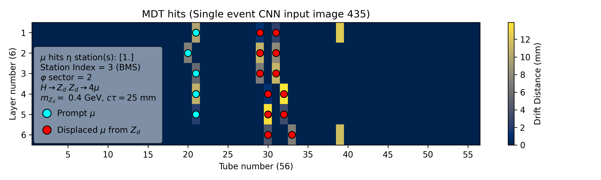
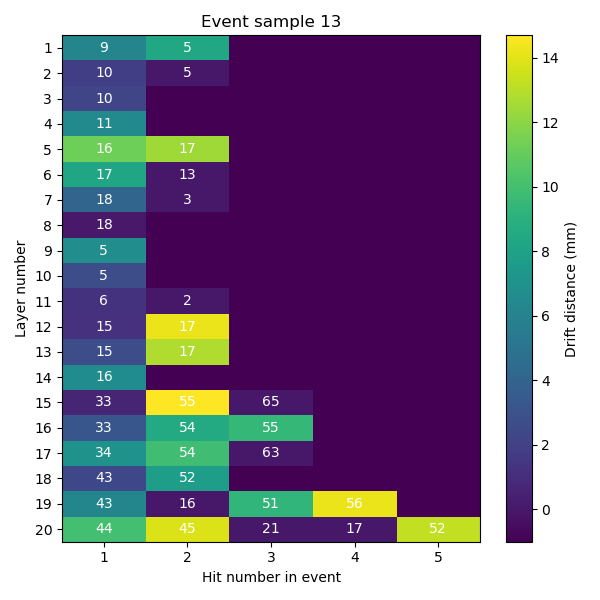

# Displaced Muon Detection Using Machine Learning: <br>ATLAS L0 Muon Trigger Upgrade</br>
A repository with the main python scripts used for the master thesis: <br><a href="https://uu.diva-portal.org/smash/record.jsf?aq2=%5B%5B%5D%5D&c=4&af=%5B%5D&searchType=LIST_LATEST&sortOrder2=title_sort_asc&language=sv&pid=diva2%3A1979429&aq=%5B%5B%5D%5D&sf=all&aqe=%5B%5D&sortOrder=author_sort_asc&onlyFullText=false&noOfRows=50&dswid=8170">Displaced Muon Detection Using Machine Learning: ATLAS L0 Muon Trigger Upgrade</a></br>

### DESCLAIMER
These files are parts of the broader repository managed and maintained by the <a href="https://nextgentriggers.web.cern.ch/t22/">NextGenTriggers (NGT) WP2 T2.2: Enhancing the Level-0 Muon Trigger</a> project group at CERN.

In this repository only the scripts written and maintained by the author of the aforementioned thesis are provided due to confidentiality reasons.  To better understand the ideas behind the project approach, please read the thesis document.

## Project Goal

In the search of new physics scenarios, many modern particle physics theories have proposed the extension of the Standard Model (SM), the current understanding of the elementary particles and their forces consisting the universe. Some of these extensions predict the existence of long-lived particles (LLPs), which decay further away from the Interaction Point (IP) producing displaced particle signatures. Unfortunately, studies around them have been hindered by a severe lack of available statistics. To address this issue, this project focuses on utilising machine learning (ML) algorithms in the form of Convolutional (CNN) and Recurrent Neural Networks (RNN) with the goal of triggering not only on prompt, but also on displaced muon event signatures using hit data from the Monitored Drift Tube (MDT) chambers of the ATLAS Muon Spectrometer (MS). For the purposes of the analysis, simulated data of the Hidden Abelian Higgs Model (HAHM) dark photon decay process were used alongside real background data from the ATLAS detector.<br>The project was conducted in collaboration with the ATLAS NGT project at CERN.</br>

## Repository structure
Scripts contained are used for the following practices:
- Ntuple data dumping
- Data preprocessing
- Data Visualization
- Machine Learning model training and testing
- Result Extraction
- Conversion to High Level Synthesis (HLS)

## Content description

The repository is structured into 4 directories, `dataProcessing`, `models`, `hls`, `plotting`, each dedicated to a different task regarding the project workflow.
These are explained below:

| Directory         | Description                                                                                  |
|-------------------|----------------------------------------------------------------------------------------------|
| `dataProcessing`  | Scripts for dumping, preprocessing and formatting data for ML applications.                  |
| `models`          | Contains training scripts for the ML models of the analysis.                                 |
| `hls`             | Scripts to convert Keras models to HLS and compare performance                               |
| `plotting`        | Scripts for data visualization and performance evaluation production plots                   |

Below a description of the contained scripts is provided.

| Script             | Description                                                                                  |
|--------------------|----------------------------------------------------------------------------------------------|
| `MdtNtupleDumper_sim.py`       | Takes as input a `.root` ntuple file and dumps the raw **HAHM** or **muon-gun simulation** data to a `.h5` file to be used for CNN and RNN input data preprocessing               |
| `MdtNtupleDumper_muonTester.py`| Takes as input a `.root` ntuple file and dumps the raw **REAL background** data to a `.h5` file after removing reconstructed muon hits to be used as noise in the CNN and RNN input data preprocessing                   |
| `preprocess_CNNsample.py`      | Takes as inputs `.h5` files (HAHM, muon-gun and background data) obtained by the ntuple dumpers and **produces the input images** to the **CNN** model in the form of `.npz` files|
| `preprocess_RNNsample.py`      | Takes as inputs `.h5` files (HAHM, muon-gun and background) obtained by the ntuple dumpers and **produces the input** to the **RNN** model in the form of `.npz` files            |
| `CNN_image_plotting.py`        | Takes as input a `.npz` file produced by the `preprocess_CNNsample.py` script and visualizes the CNN input images contained in the file            |
| `CNN.py`                       | Takes as input a `.npz` file produced by the `preprocess_CNNsample.py` script, splits the data into train, cross-validation and test sets, trains the CNN and outputs a trained model as a `.h5` file, as well as a results `.npz` file |
| `RNN.py`                       | Takes as input a `.npz` file produced by the `preprocess_RNNsample.py` script, splits the data into train, cross-validation and test sets, trains the CNN and outputs a trained model as a `.h5` file, as well as a results `.npz` file along with useful evaluation plots            |
| `Plot_CNN_results.py`             | Takes as input a `.npz` file produced by the `CNN.py` script and produces various model evaluation plots    |                                    
| `hls_CNN.py`                   | Script produced through <a href="https://fastmachinelearning.org/hls4ml/">*hls4ml*<a/>. Takes the trained Keras model, converts it to HLS and uses another `.npz` input file, which serves as a separate validation set to compare performance between the two CNN model versions. |
| `hls_RNN.py`                   | Script produced through <a href="https://fastmachinelearning.org/hls4ml/">*hls4ml*<a/>. Takes the trained Keras model, converts it to HLS and uses another `.npz` input file, which serves as a separate validation set to compare performance between the two RNN model versions. |

# How to use
## Step 1: Sample Generation
Detailed description of the sample generation process used, cannot be provided publicly due to being CERN property.
<br>It can, however, be stated that ATHENA was used to extract ntuples of simulated HAHM and muon-gun data and ATLAS Run3 data were used to infuse background noise.</br>

## Step 2: Data processing
After obtaining the raw `.root` files containing HAHM, muon-gun or real background data one may proceed with the data processing and formatting to be used by the ML models. First, one needs to pass the `.root` files through the dumper scripts. An example usage of the dumper scripts would be:
- For the HAHM process data:<br>```python MdtNtupleDumper_sim.py --input my_HAHM_input.root --output my_HAHM_output.h5```</br>
- For the muon-gun data:<br>```python MdtNtupleDumper_sim.py --input my_mg_input.root --output my_mg_output.h5 --mask_photon```</br>
- For the real background data:<br>```python MdtNtupleDumper_muonTester.py --input my_bg_input.root --output my_bg_output.h5```</br>

With the `.h5` data files at hand, one may proceed with data preprocessing.

### CNN preprocessing
The input images for the CNN models are representations of the MDT chambers in a specific $η$ region (either positive or negative $η$ stations), one $φ$ sector and a specific barrel station, where one pixel corresponds to a single MDT for a single event.
The overall shape of the arrays containing the images is $(N, Nlayers, Ntubes, 1)$, where $N$ is the number of event images, $N_{layers}$ is the number of total tube layers found in an MDT chamber of the region, $N_{tubes}$ is the total number of tubes found in the $η$ region covered and the final 1 refers to the nummber of channels (features), which for clarity can either be the drift distance values of the initial ionizing particle hitting an MDT, the displacement values, if a hit originates from a displaced muon or the target labels, i.e. "1 - muon" or "0 - not muon".



An example command to build the CNN images of a selected `.h5` data sample would be:
```bash
   python preprocess_CNNsample.py --input my_HAHM_input.h5 --output my_images_output.npz --background my_bg_input.h5 --muon_gun my_mg_input.h5 --format s --phi_stations 1 2 3 4 5 8 
```
The command above produces images in a single $η$ station `--format s` (there is also an option for images across either the full positive or either the full negative $η$ range, option `h`) and loops over $φ$ stations 1, 2, 3, 4, 5, 8 (`--phi_stations 1 2 3 4 5 8`). There are additional arguments to be passed if one is willing to do so for more specific configuration, however if not done so, the default values will automatically be picked up by the script. The extra arguments are:
- `--numbarrel` $\rightarrow$ determines the barrel station and default is `3` (0 - BIS, 1 - BIL, 2 - BMS, 3 - BML, 4 - BIL,5 - BIS).
- `--ratio` $\rightarrow$ determines the ratio $\frac{N_{S}}{N_{S} + N_{B}}$ of the dataset, where $N_{S}$ is the number of images containing (displaced) muon hits and $N_{B}$ is the number of images labelled exclusively with 0 values. Default is `0.5`.
- `--eta_pos` $\rightarrow$ determines whether to produce images of only positive or only negative $η$ stations (1 - only positive, 2 - only negative). Default is `1`.
- `--label_single` $\rightarrow$ determines whether to also label hits from prompt muons (task dependent). If not called, defaults to `False`.

### RNN preprocessing
The RNN input was chosen to consist of information regarding the tube, as well as a feature according to the use of that input, i.e. driift distance, label or displacement value corresponding to each recorded hit. Each input example corresponds to a single event and includes the information (tube, feature value) from all 20 MDT layers $(BI + BM + BO \equiv 8 + 6 + 6 = 20)$, one $φ$ sector and one $η$ station. Up to 5 hits were recorded per tube layer and all data were ordered chronologically, so as to take advantage of the capability of the RNN to extract information from sequential data.



An example command to build the RNN input of a selected `.h5` data sample would be:
```bash
   python preprocess_RNNsample.py --input my_HAHM_input.h5 --output my_RNN_data_output.npz --background my_bg_input.h5 my_mg_input.h5
```

The command above produces RNN input data given an HAHM process sample, a backround sample and a muon gun sample with prompt muon hits. There are additional (optional arguments), such as `--ratio`, which works identically to that of of the CNN script and<br>`--excludeprompt` to prevent labelling of prompt muons as 1.</br>

## Step 3: Input data visualization (optional, but recommended):
After obtaining the inputs for the ML models, one could proceed with a visualization to ensure inputs are of proper shape and contain information that reflects their data.

This can be done by running the `CNN_image_plotting.py` script and specifying the dark photon mass in GeV, as well as its average lifetime in mm (according to the sample). An example usage would be:
```bash
   python CNN_image_plotting.py --input my_CNN_input.npz --mass 0.4 --lifetime 25
```
There are two additional (optional) arguments to be passed: `--events`, a list of event images that one wants to save in `.png` format, and `--num_graphs` which determines the number of graphs (images) to be plotted.

## Step 4: Neural network training and testing
After obtaining the neural network inputs, one can tune the `CNN.py` and `RNN.py` scripts according to their needs, train and test their algorithms. There is also an option to apply a displacement threshold cut, in case one wants to restrict the analysis on displacement values above the threshold value. This option is exclusive to the CNN. The threshold cut for the RNN is applied when choosing to exclude prompt muon labelling during preprocessing.

To train and test a CNN, while also saving the trained model, one can run:

```bash
   python CNN.py --input my_CNN_input.npz --model my_CNN_model.h5 --output my_CNN_results.npz
```
The additional (optional) and task dependent tasks are:
- `--threshold` $\rightarrow$ determines the displacement threshold value in mm
- `--numbarrel` $\rightarrow$ determines the barrel station similar to the `preprocess_CNNsample.py` script. Default is `3`.
- `--ratio` $\rightarrow$ determines the $\frac{N_{S}}{N_{S} + N_{B}}$ ratio similar to the `preprocess_CNNsample.py` script. Default is `0.75`.

To train and test an RNN, while also saving the trained model, one can run:

```bash
   python RNN.py --input my_RNN_input.npz --model my_RNN_model.h5 --output my_RNN_results.npz
```

The RNN script automatically plots and saves some evaluation plots to inspect model performance.

To evaluate the performance of the CNN, one can run the `Plot_CNN_results.py` using as input the `my_CNN_results.npz` file obtained from the `CNN.py` script and passing as arguments the sample parameters (mass, lifetime etc.).
```bash
   python Plot_CNN_results.py --input my_CNN_results.npz --mass <dark_photon_mass_in_GeV> --lifetime <dark_photon_average_lifetime> 
```
Step 5: HLS conversion

To convert the trained model to the HLS version run the corresponding HLS script using as input a separate validation `.npz` data file, as well as the trained Keras model `.h5` file. The output is the results of the converted model on the validation dataset.

CNN example:
```bash
   python hls_CNN.py --input my_CNN_validation.npz --model my_CNN_model.h5 --output my_hls_CNN_results.npz
```

RNN example:
```bash
   python hls_RNN.py --input my_RNN_validation.npz --model my_RNN_model.h5 --output my_hls_RNN_results.npz
```

Thanks for your time. Hope you find this repo useful!
